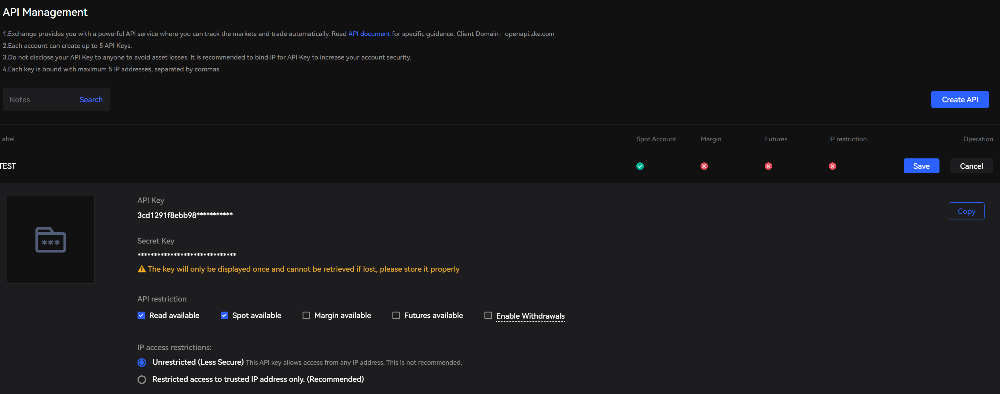
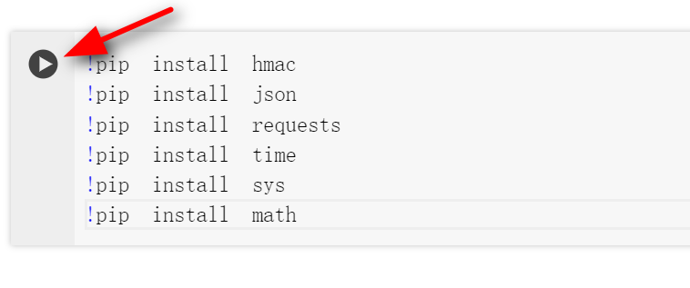
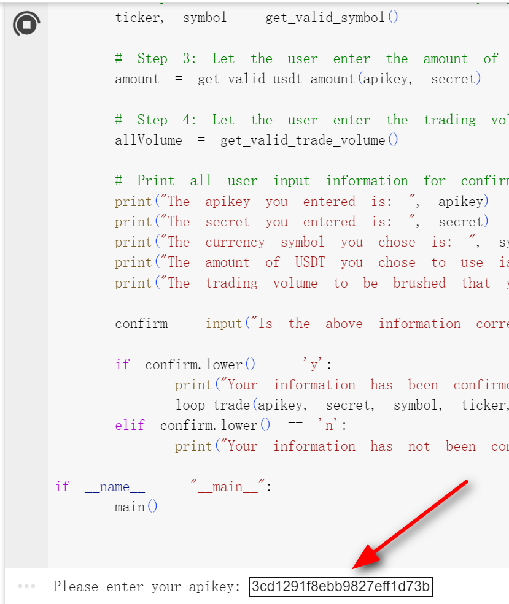
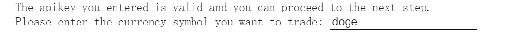
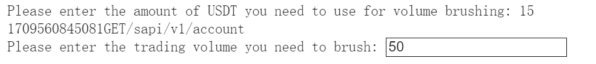
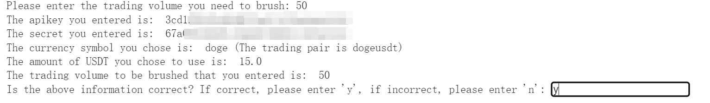
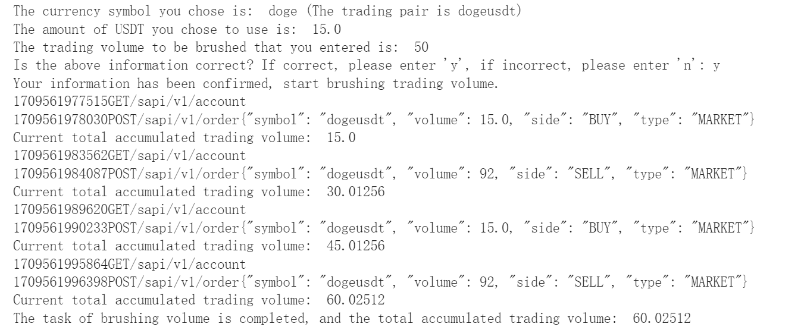

# zkbairdrop  - https://airdrop.zke.com/

Trade cryptocurrency on ZKE Exchange and receive ZKB token airdrops.         
Increase your trading volume immediately! 

# ZKE Exchange Volume Brushing Script for 1:1 ZKB Airdrop
# One-click Python script for brushing volume on ZKE.

Instructions:

1. First, go to ZKE Exchange, log in to your account and create an API Key, with only read and spot trading permissions enabled. Copy and save your API Key and Secret Key.



2. Open https://colab.google/ to use Google's free Python runtime environment. You need to log in with a Google account. After logging in, click on "New Notebook", copy and paste the following code into the code box, click the run button to install the base library, and wait for the installation to complete.

```bash
!pip install hmac
!pip install json
!pip install requests
!pip install time
!pip install sys
!pip install math
```



3. Next, click on the code input box, press CTRL + A to select all and delete, select all the code in loopTrade.py and copy it with CTRL+C, go back to the https://colab.google/ interface's code input box and press CTRL+V to paste the code. Then click the "Run" code button next to it.

   After entering the API Key as prompted and pressing Enter, enter the Secret Key and press Enter. The system will confirm whether the information you entered is correct. If it is correct, press Y to proceed to the next step, if not, enter N to re-enter.

   

4. After entering y, the system will check whether the API is correct. After confirming that the API Key is usable, it will proceed to the next step, which is to enter the currency you want to trade, such as BTC, ETH, DOGE, TRX...

   

   After entering, press Enter to proceed to the next step.

5. Enter the initial capital you want to use for volume brushing. For example, if you plan to use 15 USDT for volume brushing, enter 15. The value entered must be less than or equal to your spot balance, otherwise, it won't succeed. Press Enter to proceed to the next step;
6. Enter the expected trading volume you want to brush. For example, if you want to brush 100 USDT of trading volume, enter 100. If you want to brush 10,000 of trading volume, enter 10,000. 

   

7. After entering, press ENTER to confirm the entered information. If all the information is correct, enter y. If you want to modify it, enter n. Finally, press Enter to execute the volume brushing.

   

8. During the volume brushing process, the buying and selling progress will be displayed. When it's completed, the result will be shown.




