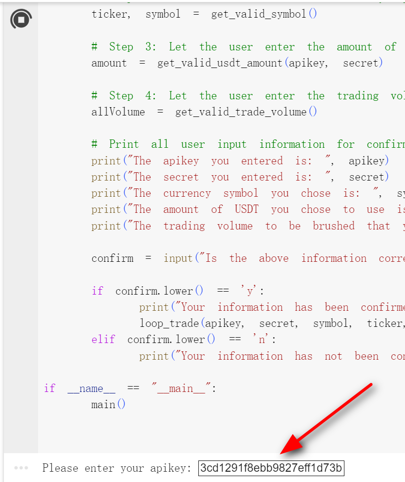
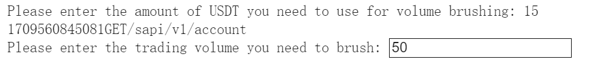
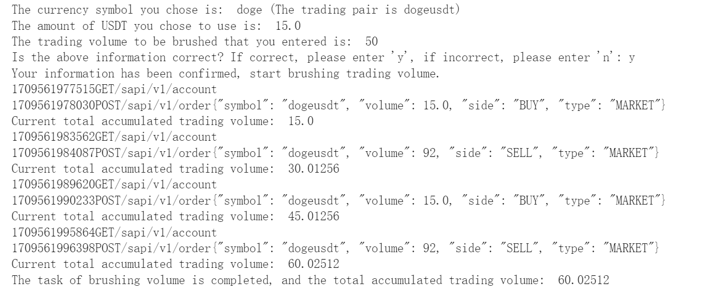

# zkbairdrop  - https://airdrop.zke.com/

# 在ZKE交易所刷交易量,1:1获取ZKE空投的平台币ZKB的刷量脚本
# ZKE刷交易量Python一键脚本.

使用方法:

1. 先去ZKE Exchange登录账户后创建个API Key,  只开通读取权限, 现货交易权限.   将API Key和 Secret Key复制保存下来.

​​​​

‍

2. 打开 https://colab.google/  使用Google免费的 Python运行环境. 登录的时候需要使用 Google账号登录.  登录之后, 点击  "New Notebook" ,  将下列代码赋值粘贴到 代码框中,点击运行按钮,安装基础库,然后等待安装完成.

```bash
!pip install hmac
!pip install json
!pip install requests
!pip install time
!pip install sys
!pip install math
```

​​

3. 接着点击代码输入框, 按键  CTRL + A 全选删除, 将 loopTrade.py 里面的代码全选复制按CTRL+C , 回到https://colab.google/界面的代码输入框按 CTRL+V , 将代码粘贴进去. 然后点击旁边的 "运行" 代码按钮.

    按照提示输入 API Key后按Enter键, 接着输入 Secret Key后按 Enter键, 提示确认输入的信息是否正确, 正确请按Y进行下一步, 不正确输入N返回重新输入.

    ​​

4. 输入 y 之后会检测API 是否正确, 确认API Key可用之后会进行下一步,让输入 你想交易的币种, 比如BTC, ETH, DOGE, TRX...   

    ​

    输入之后, 按 Enter 键进行下一步.

5. 输入你要刷交易量的初始资金, 比如你将用 15USDT进行刷交易量则输入 15 ,输入的数值必须保证小于等于你的现货余额. 否则不会成功. 按 Enter键 进入下一步;
6. 输入你要刷交易量的预期交易量, 比如你要刷 100USDT的交易量,则输入100, 刷10000的交易量,则输入10000.  

    ​​

7. 输入完成后按ENTER 键进行输入信息的确认. 输入信息都正确输入y, 要修改输入 n, 最后按Enter 执行刷交易量

    ​​​​

8. 刷交易量过程中会显示买卖进程, 完成之后, 会显示结果

​​
